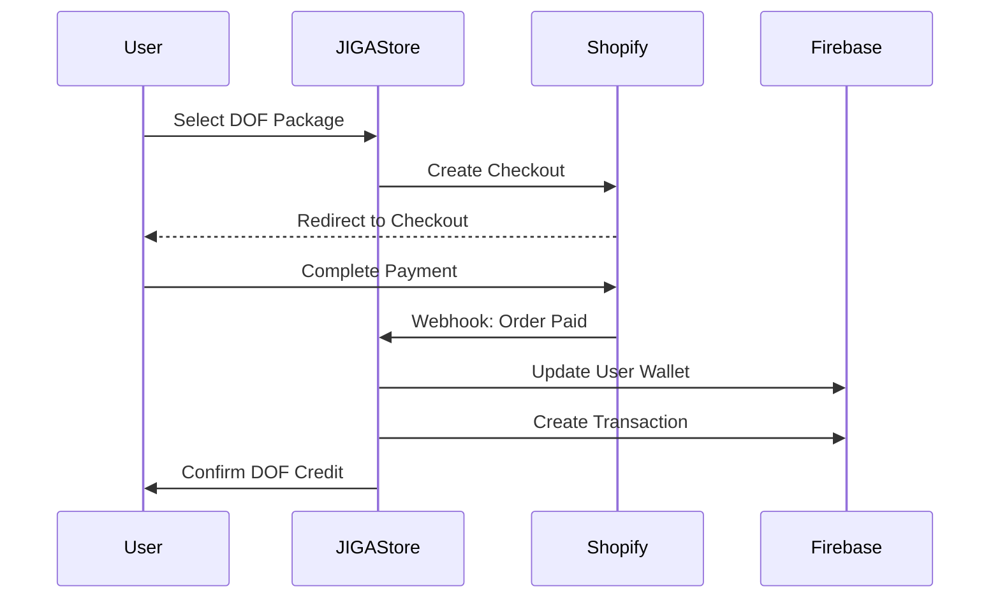

# JIGA Store Implementation Plan

## 📋 Executive Summary

The JIGA Store is a marketplace service for hosting, managing, and selling Joint Intelligence Gaming Assistants (JIGA Agents). This service will integrate with Firebase for data persistence, Shopify for payment processing, and expose APIs for multiple frontend and backend clients.

## 🏗️ System Architecture

### High-Level Architecture

```
┌─────────────────────────────────────────────────────────────────┐
│                         Client Layer                              │
├─────────────────────┬─────────────────────┬────────────────────┤
│   Web Dashboard     │   Mobile Apps       │   Game Clients      │
└──────────┬──────────┴──────────┬──────────┴──────────┬─────────┘
           │                     │                       │
           ▼                     ▼                       ▼
┌─────────────────────────────────────────────────────────────────┐
│                    JIGA Store API Gateway                         │
│                    (REST API + WebSocket)                         │
└─────────────────────────────────────────────────────────────────┘
           │                     │                       │
           ▼                     ▼                       ▼
┌─────────────────┬──────────────────────┬──────────────────────┐
│  Agent Service  │  Marketplace Service  │  Transaction Service │
├─────────────────┼──────────────────────┼──────────────────────┤
│  User Service   │  Analytics Service    │  Notification Service│
└─────────────────┴──────────────────────┴──────────────────────┘
           │                     │                       │
           ▼                     ▼                       ▼
┌─────────────────────────────────────────────────────────────────┐
│                    Data Layer (Firebase)                          │
├─────────────────┬──────────────────────┬──────────────────────┤
│    Firestore    │   Cloud Storage      │   Realtime Database   │
└─────────────────┴──────────────────────┴──────────────────────┘
           │                     │                       │
           ▼                     ▼                       ▼
┌─────────────────────────────────────────────────────────────────┐
│                 External Services                                 │
├─────────────────┬──────────────────────┬──────────────────────┤
│     Shopify     │   Stripe Connect     │   Analytics (GA4)     │
└─────────────────┴──────────────────────┴──────────────────────┘
```

### Core Services Breakdown

#### 1. **Agent Service**
- Agent CRUD operations
- Configuration management
- Version control
- Agent validation
- Badge and achievement tracking

#### 2. **Marketplace Service**
- Search and discovery
- Filtering and sorting
- Featured agents
- Category management
- Reviews and ratings

#### 3. **Transaction Service**
- DOF purchases
- Agent hiring
- Revenue distribution
- Refund handling
- Transaction history

#### 4. **User Service**
- Authentication/Authorization
- Profile management
- Agent ownership
- Wallet management
- Preferences

#### 5. **Analytics Service**
- Usage tracking
- Performance metrics
- Revenue analytics
- Market insights
- Agent popularity

#### 6. **Notification Service**
- Real-time updates
- Email notifications
- Push notifications
- WebSocket events

## 📊 Data Models

### Firebase Collections Structure

```typescript
// users/{userId}
interface User {
  id: string;
  email: string;
  displayName: string;
  avatar?: string;
  nationality?: string;
  timezone: string;
  createdAt: Timestamp;
  updatedAt: Timestamp;
  
  // DOF Wallet
  wallet: {
    balance: number;
    currency: 'DOF';
    history: TransactionReference[];
  };
  
  // Owned Agents
  ownedAgents: AgentReference[];
  
  // Published Specialists
  publishedSpecialists: string[];
  
  // Marketplace Stats
  marketplaceStats: {
    totalEarnings: number;
    totalHires: number;
    averageRating: number;
    ratingCount: number;
  };
  
  // Preferences
  preferences: {
    notifications: NotificationPreferences;
    privacy: PrivacySettings;
  };
}

// agents/{agentId}
interface Agent {
  id: string;
  ownerId: string;
  
  // Core Identity
  name: string;
  imageUrl: string;
  rank: 'Bronze' | 'Silver' | 'Gold' | 'Platinum';
  type: 'Assistant' | 'Mentor' | 'Specialist';
  
  // Provider Configuration
  provider: 'gemini' | 'google' | 'openai';
  modelConfig: {
    primary: ModelConfig;
    fallback?: ModelConfig;
  };
  
  // Cultural Identity
  nationality: string;
  language: string;
  voiceId: string;
  
  // Features
  hasVoiceChat: boolean;
  hasCommentator: boolean;
  hasMemory: boolean;
  
  // Tools
  toolkit: string[];
  
  // Specialization (for Specialists)
  specialization?: {
    games: string[];
    focus: string;
    specialistType: 'Trained' | 'Experience';
  };
  
  // Experience & Progression
  experience: ExperienceItem[];
  achievements: Achievement[];
  progressionEnabled: boolean;
  
  // Marketplace
  marketplaceStatus: {
    isPublished: boolean;
    isHirable: boolean;
    publishedAt?: Timestamp;
    pricing: PricingConfig;
    availability: AvailabilityConfig;
  };
  
  // Configuration
  configuration: AgentConfiguration;
  
  // Metadata
  createdAt: Timestamp;
  updatedAt: Timestamp;
  version: string;
}

// marketplace/{listingId}
interface MarketplaceListing {
  id: string;
  agentId: string;
  ownerId: string;
  
  // Listing Details
  title: string;
  description: string;
  tags: string[];
  category: string[];
  
  // Pricing
  pricing: {
    hourly: number;
    daily: number;
    weekly: number;
    currency: 'DOF';
  };
  
  // Stats
  stats: {
    totalHires: number;
    activeHires: number;
    rating: number;
    ratingCount: number;
    successRate: number;
  };
  
  // Reviews
  featuredReviews: Review[];
  
  // Search Optimization
  searchKeywords: string[];
  specializations: BadgeSpecialization[];
  
  // Status
  status: 'active' | 'paused' | 'under_review' | 'suspended';
  
  // Metadata
  createdAt: Timestamp;
  updatedAt: Timestamp;
}

// transactions/{transactionId}
interface Transaction {
  id: string;
  type: 'purchase' | 'hire' | 'earning' | 'refund' | 'transfer';
  
  // Parties
  fromUserId: string;
  toUserId?: string;
  agentId?: string;
  
  // Amount
  amount: number;
  currency: 'DOF' | 'USD';
  exchangeRate?: number;
  
  // Distribution (for marketplace transactions)
  distribution?: {
    owner: number;
    platform: number;
    creator: number;
  };
  
  // Status
  status: 'pending' | 'completed' | 'failed' | 'refunded';
  
  // Payment
  paymentMethod?: 'shopify' | 'stripe' | 'wallet';
  externalReference?: string;
  
  // Metadata
  metadata: {
    [key: string]: any;
  };
  
  createdAt: Timestamp;
  completedAt?: Timestamp;
}

// sessions/{sessionId}
interface AgentSession {
  id: string;
  agentId: string;
  userId: string;
  ownerId: string;
  
  // Session Type
  type: 'owned' | 'hired' | 'trial';
  
  // Duration
  startedAt: Timestamp;
  expiresAt: Timestamp;
  endedAt?: Timestamp;
  
  // DOF Tracking
  dofConsumed: number;
  dofRemaining: number;
  dofEarned?: number;
  
  // Configuration
  configuration: SessionConfiguration;
  
  // Performance
  metrics: SessionMetrics;
  
  // Review (for hired sessions)
  review?: {
    rating: number;
    comment: string;
    helpful: boolean;
  };
}

// badges/{badgeId}
interface Badge {
  id: string;
  name: string;
  game: string;
  imageUrl: string;
  specializations: BadgeSpecialization[];
  
  // Requirements
  requirements: {
    hoursRequired: number;
    additionalCriteria?: string[];
  };
  
  // Stats
  totalAwarded: number;
  activeSpecialists: number;
}

// reviews/{reviewId}
interface Review {
  id: string;
  agentId: string;
  sessionId: string;
  reviewerId: string;
  
  rating: number;
  title?: string;
  comment: string;
  
  // Helpfulness
  helpful: number;
  notHelpful: number;
  
  // Verification
  verified: boolean;
  hoursUsed: number;
  
  createdAt: Timestamp;
  updatedAt: Timestamp;
}
```

## 🔌 API Design

### RESTful API Endpoints

```typescript
// Base URL: https://api.jigastore.com/v1

// Authentication
POST   /auth/login
POST   /auth/logout
POST   /auth/refresh
GET    /auth/user

// Agents
GET    /agents                    // List user's agents
POST   /agents                    // Create new agent
GET    /agents/:id                // Get agent details
PUT    /agents/:id                // Update agent
DELETE /agents/:id                // Delete agent
POST   /agents/:id/publish        // Publish to marketplace
POST   /agents/:id/unpublish      // Remove from marketplace

// Agent Configuration
GET    /agents/:id/config         // Get configuration
PUT    /agents/:id/config         // Update configuration
POST   /agents/:id/config/validate // Validate configuration

// Marketplace
GET    /marketplace               // Browse listings
GET    /marketplace/featured      // Featured agents
GET    /marketplace/categories    // Get categories
GET    /marketplace/:id           // Get listing details
POST   /marketplace/:id/hire      // Hire an agent
GET    /marketplace/search        // Search with filters

// Sessions
GET    /sessions                  // List active sessions
POST   /sessions                  // Start new session
GET    /sessions/:id              // Get session details
PUT    /sessions/:id              // Update session
DELETE /sessions/:id              // End session
POST   /sessions/:id/review       // Submit review

// Transactions
GET    /transactions              // Transaction history
POST   /transactions/purchase     // Purchase DOFs
POST   /transactions/transfer     // Transfer DOFs
GET    /transactions/:id          // Transaction details

// User Profile
GET    /profile                   // Get profile
PUT    /profile                   // Update profile
GET    /profile/wallet            // Wallet details
GET    /profile/stats             // Marketplace stats

// Analytics
GET    /analytics/agents          // Agent performance
GET    /analytics/earnings        // Earnings analytics
GET    /analytics/usage           // Usage statistics

// Badges & Achievements
GET    /badges                    // Available badges
GET    /badges/earned             // User's badges
GET    /achievements              // User achievements
```

### WebSocket Events

```typescript
// Connection: wss://ws.jigastore.com

// Client -> Server Events
interface ClientEvents {
  'subscribe': { channels: string[] };
  'unsubscribe': { channels: string[] };
  'ping': {};
}

// Server -> Client Events
interface ServerEvents {
  // Agent Updates
  'agent.updated': { agentId: string; changes: any };
  'agent.published': { agentId: string; listingId: string };
  'agent.hired': { agentId: string; sessionId: string };
  
  // Session Updates
  'session.started': { sessionId: string };
  'session.ended': { sessionId: string };
  'session.dof_update': { sessionId: string; consumed: number; remaining: number };
  
  // Transaction Updates
  'transaction.completed': { transactionId: string };
  'transaction.failed': { transactionId: string; error: string };
  
  // Marketplace Updates
  'marketplace.new_review': { agentId: string; reviewId: string };
  'marketplace.rating_updated': { agentId: string; newRating: number };
  
  // Notifications
  'notification': { type: string; title: string; message: string; data?: any };
}
```

## 🔒 Security & Authentication

### Authentication Flow

```typescript
// JWT Token Structure
interface JWTPayload {
  sub: string;          // User ID
  email: string;
  role: 'user' | 'admin';
  iat: number;
  exp: number;
}

// API Key for Service-to-Service
interface APIKey {
  id: string;
  name: string;
  permissions: string[];
  rateLimit: number;
  expiresAt?: Date;
}
```

### Security Measures

1. **Authentication**
   - Firebase Auth integration
   - JWT tokens with refresh mechanism
   - API keys for service integration
   - OAuth2 for third-party apps

2. **Authorization**
   - Role-based access control (RBAC)
   - Resource-level permissions
   - Agent ownership verification
   - Transaction authorization

3. **Data Protection**
   - Encryption at rest (Firebase)
   - TLS 1.3 for data in transit
   - PII data anonymization
   - GDPR compliance

4. **Rate Limiting**
   - Per-user rate limits
   - Per-endpoint throttling
   - DDoS protection
   - Cost-based limiting for expensive operations

## 🛒 Shopify Integration

### Integration Architecture

```typescript
// Shopify Product Structure
interface ShopifyDOFProduct {
  id: string;
  title: string;              // "150,000 DOFs - Bronze Package"
  vendor: 'JIGA Store';
  productType: 'Digital';
  tags: ['dof', 'bronze', 'gaming-assistant'];
  
  variants: [{
    id: string;
    price: string;          // "4.99"
    sku: string;            // "DOF-150K-BRONZE"
    inventoryPolicy: 'continue';  // Digital product
    fulfillmentService: 'manual';
    
    metafields: {
      dof_amount: '150000';
      tier: 'bronze';
      bonus_dof: '0';
    };
  }];
}

// Webhook Handlers
interface ShopifyWebhooks {
  'orders/create': (order: ShopifyOrder) => Promise<void>;
  'orders/paid': (order: ShopifyOrder) => Promise<void>;
  'orders/cancelled': (order: ShopifyOrder) => Promise<void>;
  'refunds/create': (refund: ShopifyRefund) => Promise<void>;
}
```

### Purchase Flow



## 🚀 Implementation Phases

### Phase 1: Foundation (Weeks 1-4)
- [ ] Project setup and architecture
- [ ] Firebase configuration
- [ ] Basic data models
- [ ] Authentication system
- [ ] Core API structure

### Phase 2: Agent Management (Weeks 5-8)
- [ ] Agent CRUD operations
- [ ] Configuration system
- [ ] Version control
- [ ] Badge system
- [ ] Experience tracking

### Phase 3: Marketplace Core (Weeks 9-12)
- [ ] Listing management
- [ ] Search and filtering
- [ ] Review system
- [ ] Rating calculations
- [ ] Featured agents

### Phase 4: Transaction System (Weeks 13-16)
- [ ] DOF wallet implementation
- [ ] Shopify integration
- [ ] Purchase flow
- [ ] Hiring mechanism
- [ ] Revenue distribution

### Phase 5: Real-time Features (Weeks 17-20)
- [ ] WebSocket infrastructure
- [ ] Session management
- [ ] Live DOF tracking
- [ ] Real-time notifications
- [ ] Analytics streaming

### Phase 6: Advanced Features (Weeks 21-24)
- [ ] Advanced search
- [ ] Recommendation engine
- [ ] Analytics dashboard
- [ ] Admin panel
- [ ] Reporting tools

### Phase 7: Testing & Optimization (Weeks 25-28)
- [ ] Load testing
- [ ] Security audit
- [ ] Performance optimization
- [ ] Bug fixes
- [ ] Documentation

### Phase 8: Launch Preparation (Weeks 29-32)
- [ ] Beta testing
- [ ] Marketing integration
- [ ] Support system
- [ ] Monitoring setup
- [ ] Launch strategy

## 📈 Scalability Considerations

### Performance Targets
- **API Response Time**: < 200ms (p95)
- **Concurrent Users**: 10,000+
- **Transactions/Second**: 1,000+
- **Search Latency**: < 100ms
- **WebSocket Connections**: 50,000+

### Scaling Strategy

1. **Horizontal Scaling**
   - Microservices architecture
   - Load balancing
   - Auto-scaling groups
   - Container orchestration (K8s)

2. **Caching Strategy**
   - Redis for session data
   - CDN for static assets
   - Firestore offline persistence
   - API response caching

3. **Database Optimization**
   - Composite indexes
   - Query optimization
   - Sharding strategy
   - Read replicas

4. **Cost Optimization**
   - Efficient DOF calculations
   - Batch processing
   - Resource pooling
   - Cold storage for analytics

## 🛠️ Technology Stack

### Backend
- **Runtime**: Node.js 18+ / Python 3.11+
- **Framework**: Express.js / FastAPI
- **Database**: Firebase Firestore
- **Storage**: Firebase Cloud Storage
- **Cache**: Redis
- **Queue**: Cloud Tasks / Pub/Sub
- **Search**: Algolia / ElasticSearch

### Infrastructure
- **Hosting**: Google Cloud Platform
- **Container**: Docker
- **Orchestration**: Kubernetes
- **CI/CD**: GitHub Actions
- **Monitoring**: Datadog / New Relic
- **Logging**: Cloud Logging

### External Services
- **Payments**: Shopify + Stripe Connect
- **Email**: SendGrid
- **SMS**: Twilio
- **Analytics**: Google Analytics 4
- **CDN**: Cloudflare

## 🔄 Integration Examples

### Client SDK Example

```typescript
// JavaScript/TypeScript SDK
import { JIGAStore } from '@jiga/store-sdk';

const store = new JIGAStore({
  apiKey: 'your-api-key',
  environment: 'production'
});

// Browse marketplace
const listings = await store.marketplace.search({
  game: 'Call of Duty',
  rank: ['Gold', 'Platinum'],
  hasVoiceChat: true,
  maxPrice: 50000,  // DOFs
  sortBy: 'rating'
});

// Hire an agent
const session = await store.agents.hire(agentId, {
  duration: 'hourly',
  hours: 2,
  configuration: {
    high_speed_vision: true,
    voice_enabled: true
  }
});

// Track DOF consumption
store.sessions.on(session.id, 'dof_update', (data) => {
  console.log(`DOFs remaining: ${data.remaining}`);
});
```

### Webhook Integration

```typescript
// Express webhook handler
app.post('/webhooks/shopify', async (req, res) => {
  const { topic, domain, payload } = req.body;
  
  switch (topic) {
    case 'orders/paid':
      await handleOrderPaid(payload);
      break;
    case 'refunds/create':
      await handleRefund(payload);
      break;
  }
  
  res.status(200).send('OK');
});
```

## 📊 Analytics & Metrics

### Key Performance Indicators (KPIs)

1. **Marketplace Metrics**
   - Total active listings
   - Daily active users
   - Conversion rate
   - Average transaction value
   - User retention rate

2. **Agent Performance**
   - Average rating by tier
   - DOF consumption patterns
   - Session duration metrics
   - Feature usage statistics

3. **Revenue Metrics**
   - Total DOF sales
   - Marketplace commission
   - Revenue per user
   - Churn rate
   - LTV calculations

4. **Operational Metrics**
   - API latency
   - Error rates
   - System uptime
   - Support ticket volume

## 🎯 Success Criteria

1. **Technical Success**
   - 99.9% uptime
   - < 200ms API response time
   - Zero critical security issues
   - Successful handling of 10k concurrent users

2. **Business Success**
   - 1000+ agents listed in first 6 months
   - 10,000+ active users
   - $100k+ monthly transaction volume
   - 4.5+ average marketplace rating

3. **User Success**
   - 80%+ user satisfaction
   - < 2% transaction dispute rate
   - 60%+ monthly active user rate
   - 40%+ user referral rate

## 📋 Risk Mitigation

### Technical Risks
- **Scalability**: Early load testing and auto-scaling
- **Security**: Regular audits and penetration testing
- **Reliability**: Redundancy and disaster recovery
- **Performance**: Continuous monitoring and optimization

### Business Risks
- **Market Adoption**: Beta program and early adopter incentives
- **Competition**: Unique features and rapid iteration
- **Fraud**: ML-based fraud detection and manual review
- **Compliance**: Legal review and terms of service

## 🚦 Next Steps

1. **Immediate Actions**
   - Set up development environment
   - Create Firebase project
   - Initialize repository structure
   - Design detailed API specifications

2. **Week 1 Deliverables**
   - Technical architecture document
   - Database schema finalization
   - API contract documentation
   - Development timeline

3. **Stakeholder Alignment**
   - Review with technical team
   - Business requirements validation
   - Resource allocation
   - Budget approval

---

**Document Version**: 1.0  
**Last Updated**: [Current Date]  
**Status**: Draft - Pending Review 