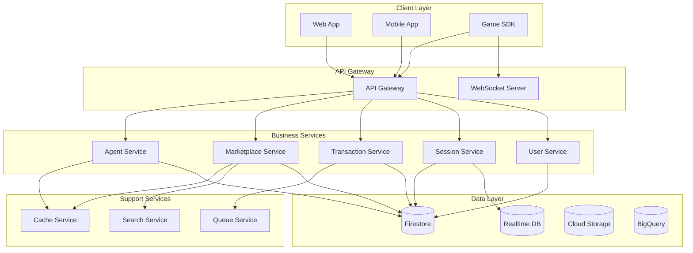

# JIGA Store Technical Architecture

## 🏛️ System Design Principles

### Core Design Principles
1. **Service-Oriented Architecture (SOA)**: Modular services with clear boundaries
2. **API-First Design**: All functionality exposed through well-defined APIs
3. **Event-Driven Architecture**: Asynchronous communication between services
4. **Domain-Driven Design**: Clear separation of business domains
5. **Cloud-Native**: Built for containerization and horizontal scaling

## 📦 Service Architecture

### Service Decomposition

```yaml
jiga-store:
  services:
    # Core Business Services
    agent-service:
      description: "Manages agent lifecycle and configurations"
      database: firestore
      collections: [agents, agent_versions, agent_configs]
      
    marketplace-service:
      description: "Handles marketplace listings and discovery"
      database: firestore
      collections: [marketplace_listings, featured_agents, categories]
      cache: redis
      search: algolia
      
    transaction-service:
      description: "Manages DOF transactions and payments"
      database: firestore
      collections: [transactions, wallets, payment_methods]
      external: [shopify, stripe]
      
    session-service:
      description: "Handles active agent sessions"
      database: firestore + realtime
      collections: [sessions, session_metrics]
      cache: redis
      
    user-service:
      description: "User management and authentication"
      database: firestore
      collections: [users, user_preferences, user_achievements]
      auth: firebase-auth
      
    analytics-service:
      description: "Analytics and reporting"
      database: bigquery
      streaming: pubsub
      processing: dataflow
      
    notification-service:
      description: "Multi-channel notifications"
      channels: [websocket, email, push]
      queue: cloud-tasks
      
    # Support Services
    search-service:
      engine: algolia
      indices: [agents, specialists, reviews]
      
    cache-service:
      engine: redis
      strategies: [write-through, write-behind]
      
    queue-service:
      engine: pubsub
      topics: [transactions, notifications, analytics]
```

### Service Communication



## 🗄️ Data Architecture

### Primary Database: Firestore

```typescript
// Collection Design Patterns

// 1. Agent Collection with Subcollections
agents/{agentId}
  - document: Agent core data
  - subcollections:
    - versions/{versionId}: Version history
    - configs/{configId}: Configuration snapshots
    - metrics/{metricId}: Performance metrics
    - earnings/{earningId}: Earning records

// 2. User Collection with References
users/{userId}
  - document: User profile
  - arrays: 
    - ownedAgents: AgentReference[]
    - activeSessions: SessionReference[]
  - subcollections:
    - transactions/{transactionId}: Transaction history
    - notifications/{notificationId}: Notification queue

// 3. Marketplace Denormalized Design
marketplace/{listingId}
  - document: Complete listing data (denormalized)
  - includes: agent data, owner info, stats
  - optimized for: read performance

// 4. Session Collection with TTL
sessions/{sessionId}
  - document: Session data
  - ttl: expiresAt field for auto-cleanup
  - realtime: mirrors to Realtime DB for live updates
```

### Caching Strategy

```typescript
interface CacheStrategy {
  // Cache Layers
  layers: {
    cdn: {
      provider: 'Cloudflare';
      ttl: 3600; // 1 hour
      content: ['images', 'static-assets'];
    };
    
    application: {
      provider: 'Redis';
      ttl: 300; // 5 minutes
      content: ['api-responses', 'user-sessions'];
    };
    
    database: {
      provider: 'Firestore';
      strategy: 'offline-persistence';
      content: ['frequently-accessed-docs'];
    };
  };
  
  // Cache Patterns
  patterns: {
    writeThrough: ['user-profiles', 'agent-configs'];
    writeBehind: ['analytics', 'metrics'];
    refresh: ['marketplace-listings', 'rankings'];
  };
}
```

### Search Architecture

```typescript
// Algolia Index Structure
interface AgentSearchIndex {
  objectID: string;  // agentId
  
  // Searchable Attributes
  name: string;
  description: string;
  tags: string[];
  specializations: string[];
  games: string[];
  
  // Facets for Filtering
  rank: string;
  type: string;
  provider: string;
  hasVoiceChat: boolean;
  hasCommentator: boolean;
  price: number;
  rating: number;
  
  // Ranking Attributes
  popularity: number;
  totalHires: number;
  successRate: number;
  
  // Display Attributes
  imageUrl: string;
  ownerId: string;
  nationality: string;
}

// Search Configuration
const searchConfig = {
  searchableAttributes: [
    'name',
    'description',
    'tags',
    'specializations',
    'games'
  ],
  
  attributesForFaceting: [
    'filterOnly(rank)',
    'filterOnly(type)',
    'filterOnly(provider)',
    'hasVoiceChat',
    'hasCommentator',
    'price',
    'rating'
  ],
  
  customRanking: [
    'desc(popularity)',
    'desc(rating)',
    'desc(totalHires)'
  ]
};
```

## 🔐 Security Architecture

### Authentication & Authorization

```typescript
// Multi-layer Security Model
interface SecurityArchitecture {
  // Layer 1: API Gateway
  gateway: {
    authentication: 'JWT';
    rateLimit: {
      authenticated: 1000; // requests per minute
      anonymous: 100;
    };
    cors: {
      origins: ['https://jiga.ai', 'https://app.jiga.ai'];
      credentials: true;
    };
  };
  
  // Layer 2: Service Authentication
  service: {
    internalAuth: 'mTLS';
    serviceAccounts: true;
    tokenValidation: 'Firebase Admin SDK';
  };
  
  // Layer 3: Data Access
  dataAccess: {
    encryption: 'AES-256-GCM';
    firebaseRules: true;
    rowLevelSecurity: true;
  };
  
  // Layer 4: Application Security
  application: {
    inputValidation: 'joi';
    outputSanitization: true;
    sqlInjectionProtection: 'parameterized-queries';
    xssProtection: 'helmet';
  };
}

// Firebase Security Rules Example
service cloud.firestore {
  match /databases/{database}/documents {
    // Users can only access their own data
    match /users/{userId} {
      allow read, write: if request.auth != null && request.auth.uid == userId;
    }
    
    // Agents are readable by all, writable by owner
    match /agents/{agentId} {
      allow read: if true;
      allow write: if request.auth != null && 
        request.auth.uid == resource.data.ownerId;
    }
    
    // Marketplace listings are public read
    match /marketplace/{listingId} {
      allow read: if true;
      allow write: if request.auth != null && 
        request.auth.uid == resource.data.ownerId &&
        resource.data.status == 'active';
    }
  }
}
```

### API Security

```typescript
// API Security Middleware Stack
const securityMiddleware = {
  // 1. Rate Limiting
  rateLimiter: rateLimit({
    windowMs: 60 * 1000, // 1 minute
    max: (req) => req.user ? 1000 : 100,
    message: 'Too many requests',
    standardHeaders: true,
    legacyHeaders: false,
  }),
  
  // 2. Authentication
  authenticate: async (req, res, next) => {
    const token = req.headers.authorization?.split(' ')[1];
    if (!token) return res.status(401).json({ error: 'Unauthorized' });
    
    try {
      const decoded = await admin.auth().verifyIdToken(token);
      req.user = decoded;
      next();
    } catch (error) {
      res.status(401).json({ error: 'Invalid token' });
    }
  },
  
  // 3. Input Validation
  validate: (schema) => (req, res, next) => {
    const { error } = schema.validate(req.body);
    if (error) return res.status(400).json({ error: error.details });
    next();
  },
  
  // 4. CORS
  cors: cors({
    origin: process.env.ALLOWED_ORIGINS?.split(','),
    credentials: true,
    optionsSuccessStatus: 200
  }),
  
  // 5. Security Headers
  helmet: helmet({
    contentSecurityPolicy: {
      directives: {
        defaultSrc: ["'self'"],
        imgSrc: ["'self'", "https:", "data:"],
        scriptSrc: ["'self'", "'unsafe-inline'"],
      },
    },
  })
};
```

## 🚀 Deployment Architecture

### Container Architecture

```yaml
# docker-compose.yml for local development
version: '3.8'

services:
  api-gateway:
    build: ./services/api-gateway
    ports:
      - "3000:3000"
    environment:
      - NODE_ENV=development
      - REDIS_URL=redis://cache:6379
    depends_on:
      - cache
      
  agent-service:
    build: ./services/agent-service
    environment:
      - FIRESTORE_EMULATOR_HOST=firestore:8080
      - PUBSUB_EMULATOR_HOST=pubsub:8085
    depends_on:
      - firestore
      - pubsub
      
  marketplace-service:
    build: ./services/marketplace-service
    environment:
      - ALGOLIA_APP_ID=${ALGOLIA_APP_ID}
      - ALGOLIA_API_KEY=${ALGOLIA_API_KEY}
      - REDIS_URL=redis://cache:6379
    depends_on:
      - cache
      
  transaction-service:
    build: ./services/transaction-service
    environment:
      - SHOPIFY_API_KEY=${SHOPIFY_API_KEY}
      - STRIPE_API_KEY=${STRIPE_API_KEY}
      
  # Infrastructure Services
  cache:
    image: redis:7-alpine
    ports:
      - "6379:6379"
      
  firestore:
    image: gcr.io/google.com/cloudsdktool/cloud-sdk:emulators
    command: gcloud emulators firestore start --host-port=0.0.0.0:8080
    ports:
      - "8080:8080"
      
  pubsub:
    image: gcr.io/google.com/cloudsdktool/cloud-sdk:emulators
    command: gcloud emulators pubsub start --host-port=0.0.0.0:8085
    ports:
      - "8085:8085"
```

### Kubernetes Architecture

```yaml
# kubernetes/api-gateway-deployment.yaml
apiVersion: apps/v1
kind: Deployment
metadata:
  name: api-gateway
  namespace: jiga-store
spec:
  replicas: 3
  selector:
    matchLabels:
      app: api-gateway
  template:
    metadata:
      labels:
        app: api-gateway
    spec:
      containers:
      - name: api-gateway
        image: gcr.io/jiga-project/api-gateway:latest
        ports:
        - containerPort: 3000
        env:
        - name: NODE_ENV
          value: "production"
        - name: REDIS_URL
          valueFrom:
            secretKeyRef:
              name: redis-secret
              key: url
        resources:
          requests:
            memory: "256Mi"
            cpu: "250m"
          limits:
            memory: "512Mi"
            cpu: "500m"
        livenessProbe:
          httpGet:
            path: /health
            port: 3000
          initialDelaySeconds: 30
          periodSeconds: 10
        readinessProbe:
          httpGet:
            path: /ready
            port: 3000
          initialDelaySeconds: 5
          periodSeconds: 5
---
apiVersion: v1
kind: Service
metadata:
  name: api-gateway-service
  namespace: jiga-store
spec:
  selector:
    app: api-gateway
  ports:
  - port: 80
    targetPort: 3000
  type: LoadBalancer
---
apiVersion: autoscaling/v2
kind: HorizontalPodAutoscaler
metadata:
  name: api-gateway-hpa
  namespace: jiga-store
spec:
  scaleTargetRef:
    apiVersion: apps/v1
    kind: Deployment
    name: api-gateway
  minReplicas: 3
  maxReplicas: 20
  metrics:
  - type: Resource
    resource:
      name: cpu
      target:
        type: Utilization
        averageUtilization: 70
  - type: Resource
    resource:
      name: memory
      target:
        type: Utilization
        averageUtilization: 80
```

## 📊 Monitoring & Observability

### Monitoring Stack

```typescript
interface MonitoringArchitecture {
  // Metrics Collection
  metrics: {
    provider: 'Datadog';
    collectors: ['StatsD', 'OpenTelemetry'];
    dashboards: [
      'Service Health',
      'API Performance',
      'Business Metrics',
      'Cost Analysis'
    ];
  };
  
  // Logging
  logging: {
    aggregator: 'Google Cloud Logging';
    format: 'structured-json';
    retention: '30 days';
    alerting: {
      errors: 'PagerDuty';
      warnings: 'Slack';
    };
  };
  
  // Tracing
  tracing: {
    provider: 'Google Cloud Trace';
    sampling: 0.1; // 10% sampling
    instrumentation: 'OpenTelemetry';
  };
  
  // Alerting Rules
  alerts: [
    {
      name: 'High Error Rate',
      condition: 'error_rate > 1%',
      duration: '5 minutes',
      severity: 'critical'
    },
    {
      name: 'API Latency',
      condition: 'p95_latency > 500ms',
      duration: '10 minutes',
      severity: 'warning'
    },
    {
      name: 'DOF Balance Low',
      condition: 'platform_dof_balance < 1000000',
      duration: '1 minute',
      severity: 'warning'
    }
  ];
}
```

### Performance Monitoring

```typescript
// Custom Metrics Collection
class MetricsCollector {
  private statsd: StatsD;
  
  // API Metrics
  recordApiCall(endpoint: string, method: string, status: number, duration: number) {
    this.statsd.increment(`api.calls`, 1, [`endpoint:${endpoint}`, `method:${method}`, `status:${status}`]);
    this.statsd.histogram(`api.duration`, duration, [`endpoint:${endpoint}`]);
  }
  
  // Business Metrics
  recordTransaction(type: string, amount: number, currency: string) {
    this.statsd.increment(`transactions.count`, 1, [`type:${type}`, `currency:${currency}`]);
    this.statsd.gauge(`transactions.amount`, amount, [`type:${type}`, `currency:${currency}`]);
  }
  
  // DOF Metrics
  recordDOFConsumption(agentId: string, amount: number, action: string) {
    this.statsd.increment(`dof.consumed`, amount, [`agent:${agentId}`, `action:${action}`]);
  }
  
  // Session Metrics
  recordSessionMetrics(sessionId: string, metrics: SessionMetrics) {
    this.statsd.gauge(`session.duration`, metrics.duration, [`session:${sessionId}`]);
    this.statsd.gauge(`session.dof_consumed`, metrics.dofConsumed, [`session:${sessionId}`]);
  }
}
```

## 🔄 Event-Driven Architecture

### Event Bus Design

```typescript
// Event Types
enum EventTypes {
  // Agent Events
  AGENT_CREATED = 'agent.created',
  AGENT_UPDATED = 'agent.updated',
  AGENT_PUBLISHED = 'agent.published',
  AGENT_UNPUBLISHED = 'agent.unpublished',
  
  // Transaction Events
  TRANSACTION_INITIATED = 'transaction.initiated',
  TRANSACTION_COMPLETED = 'transaction.completed',
  TRANSACTION_FAILED = 'transaction.failed',
  
  // Session Events
  SESSION_STARTED = 'session.started',
  SESSION_ENDED = 'session.ended',
  SESSION_DOF_UPDATE = 'session.dof_update',
  
  // Marketplace Events
  LISTING_VIEWED = 'listing.viewed',
  AGENT_HIRED = 'agent.hired',
  REVIEW_SUBMITTED = 'review.submitted',
}

// Event Publisher
class EventPublisher {
  private pubsub: PubSub;
  
  async publishEvent<T>(eventType: EventTypes, data: T, metadata?: any) {
    const event = {
      id: uuidv4(),
      type: eventType,
      timestamp: new Date().toISOString(),
      data,
      metadata: {
        ...metadata,
        version: '1.0',
        source: process.env.SERVICE_NAME
      }
    };
    
    const topic = this.getTopicForEvent(eventType);
    await this.pubsub.topic(topic).publishMessage({
      json: event,
      attributes: {
        eventType,
        timestamp: event.timestamp
      }
    });
  }
}

// Event Handlers
class EventHandlers {
  @Subscribe(EventTypes.AGENT_PUBLISHED)
  async handleAgentPublished(event: Event<AgentPublishedData>) {
    // Update search index
    await this.searchService.indexAgent(event.data.agentId);
    
    // Send notification
    await this.notificationService.notifyUser(event.data.ownerId, {
      type: 'agent_published',
      title: 'Agent Published Successfully',
      message: `Your agent ${event.data.agentName} is now live in the marketplace!`
    });
    
    // Update analytics
    await this.analyticsService.trackEvent('agent_published', {
      agentId: event.data.agentId,
      rank: event.data.rank,
      type: event.data.type
    });
  }
  
  @Subscribe(EventTypes.TRANSACTION_COMPLETED)
  async handleTransactionCompleted(event: Event<TransactionCompletedData>) {
    // Update user wallet
    await this.userService.updateWallet(event.data.userId, event.data.amount);
    
    // Distribute revenue (for marketplace transactions)
    if (event.data.distribution) {
      await this.distributeRevenue(event.data.distribution);
    }
    
    // Send confirmation
    await this.notificationService.sendTransactionConfirmation(event.data);
  }
}
```

## 🏗️ Infrastructure as Code

### Terraform Configuration

```hcl
# terraform/main.tf

terraform {
  required_providers {
    google = {
      source  = "hashicorp/google"
      version = "~> 4.0"
    }
  }
}

provider "google" {
  project = var.project_id
  region  = var.region
}

# Firestore Database
resource "google_firestore_database" "main" {
  project     = var.project_id
  name        = "(default)"
  location_id = var.region
  type        = "FIRESTORE_NATIVE"
}

# Cloud Storage Buckets
resource "google_storage_bucket" "agent_assets" {
  name     = "${var.project_id}-agent-assets"
  location = var.region
  
  lifecycle_rule {
    condition {
      age = 30
    }
    action {
      type = "SetStorageClass"
      storage_class = "NEARLINE"
    }
  }
}

# Redis Instance
resource "google_redis_instance" "cache" {
  name           = "jiga-store-cache"
  tier           = "STANDARD_HA"
  memory_size_gb = 5
  region         = var.region
  
  redis_configs = {
    maxmemory-policy = "allkeys-lru"
  }
}

# GKE Cluster
resource "google_container_cluster" "main" {
  name     = "jiga-store-cluster"
  location = var.region
  
  initial_node_count = 3
  
  node_config {
    machine_type = "n2-standard-4"
    disk_size_gb = 100
    
    oauth_scopes = [
      "https://www.googleapis.com/auth/cloud-platform"
    ]
  }
  
  addons_config {
    horizontal_pod_autoscaling {
      disabled = false
    }
    
    http_load_balancing {
      disabled = false
    }
  }
}

# Cloud Pub/Sub Topics
resource "google_pubsub_topic" "events" {
  for_each = toset([
    "agent-events",
    "transaction-events",
    "session-events",
    "notification-events"
  ])
  
  name = each.value
  
  message_retention_duration = "86400s" # 1 day
}

# API Gateway
resource "google_api_gateway_api" "main" {
  provider = google-beta
  api_id   = "jiga-store-api"
  
  display_name = "JIGA Store API"
  
  gateway_config {
    backend_config {
      google_service_account = google_service_account.api_gateway.email
    }
  }
}
```

## 📈 Performance Optimization

### Optimization Strategies

```typescript
interface PerformanceOptimizations {
  // Database Optimizations
  database: {
    indexing: {
      composite: [
        ['ownerId', 'createdAt'],
        ['rank', 'rating', 'price'],
        ['game', 'specialization', 'isHirable']
      ];
      single: ['agentId', 'userId', 'sessionId'];
    };
    
    denormalization: {
      marketplaceListing: 'full agent data copy';
      userStats: 'aggregated metrics';
      agentRatings: 'pre-calculated averages';
    };
    
    caching: {
      strategy: 'write-through';
      ttl: {
        listings: 300,    // 5 minutes
        profiles: 600,    // 10 minutes
        static: 3600      // 1 hour
      };
    };
  };
  
  // API Optimizations
  api: {
    pagination: {
      defaultLimit: 20;
      maxLimit: 100;
      cursorBased: true;
    };
    
    fieldSelection: {
      graphqlLike: true;
      defaultFields: 'minimal';
      expandable: ['details', 'stats', 'reviews'];
    };
    
    compression: {
      algorithm: 'gzip';
      threshold: 1024; // bytes
    };
  };
  
  // Frontend Optimizations
  frontend: {
    bundleSize: {
      splitting: 'route-based';
      lazyLoading: true;
      treeShaking: true;
    };
    
    caching: {
      serviceWorker: true;
      cdnCaching: true;
      browserCache: 'aggressive';
    };
    
    images: {
      format: 'webp';
      lazyLoading: true;
      responsive: true;
    };
  };
}
```

### Query Optimization Examples

```typescript
// Optimized Firestore Queries

// Bad: Multiple reads
const agent = await db.collection('agents').doc(agentId).get();
const reviews = await db.collection('reviews')
  .where('agentId', '==', agentId).get();
const sessions = await db.collection('sessions')
  .where('agentId', '==', agentId).get();

// Good: Batch read with cache
const batch = db.batch();
const agentRef = db.collection('agents').doc(agentId);
const reviewsRef = db.collection('reviews')
  .where('agentId', '==', agentId).limit(10);
const statsRef = agentRef.collection('stats').doc('current');

const [agent, reviews, stats] = await Promise.all([
  cache.get(`agent:${agentId}`) || agentRef.get(),
  cache.get(`reviews:${agentId}`) || reviewsRef.get(),
  cache.get(`stats:${agentId}`) || statsRef.get()
]);

// Cache results
await Promise.all([
  cache.set(`agent:${agentId}`, agent, 300),
  cache.set(`reviews:${agentId}`, reviews, 300),
  cache.set(`stats:${agentId}`, stats, 60)
]);
```

## 🔧 Development Guidelines

### Code Organization

```
jiga-store/
├── services/
│   ├── api-gateway/
│   │   ├── src/
│   │   ├── tests/
│   │   ├── Dockerfile
│   │   └── package.json
│   ├── agent-service/
│   ├── marketplace-service/
│   ├── transaction-service/
│   └── shared/
│       ├── models/
│       ├── utils/
│       └── middleware/
├── infrastructure/
│   ├── terraform/
│   ├── kubernetes/
│   └── scripts/
├── sdk/
│   ├── javascript/
│   ├── python/
│   └── unity/
└── docs/
    ├── api/
    ├── architecture/
    └── guides/
```

### Development Standards

```typescript
// Service Template
export class BaseService {
  protected logger: Logger;
  protected metrics: MetricsCollector;
  protected cache: CacheService;
  
  constructor(
    protected db: Firestore,
    protected config: ServiceConfig
  ) {
    this.logger = new Logger(this.constructor.name);
    this.metrics = new MetricsCollector(config.metrics);
    this.cache = new CacheService(config.cache);
  }
  
  // Health check endpoint
  async healthCheck(): Promise<HealthStatus> {
    const checks = await Promise.all([
      this.checkDatabase(),
      this.checkCache(),
      this.checkDependencies()
    ]);
    
    return {
      status: checks.every(c => c.healthy) ? 'healthy' : 'unhealthy',
      checks,
      timestamp: new Date().toISOString()
    };
  }
  
  // Standard error handling
  protected handleError(error: Error, context: any): never {
    this.logger.error('Service error', { error, context });
    this.metrics.increment('errors', 1, { service: this.constructor.name });
    
    if (error instanceof ValidationError) {
      throw new BadRequestError(error.message);
    } else if (error instanceof NotFoundError) {
      throw error;
    } else {
      throw new InternalServerError('An unexpected error occurred');
    }
  }
}
```

---

**Document Version**: 1.0  
**Last Updated**: [Current Date]  
**Status**: Technical Specification 